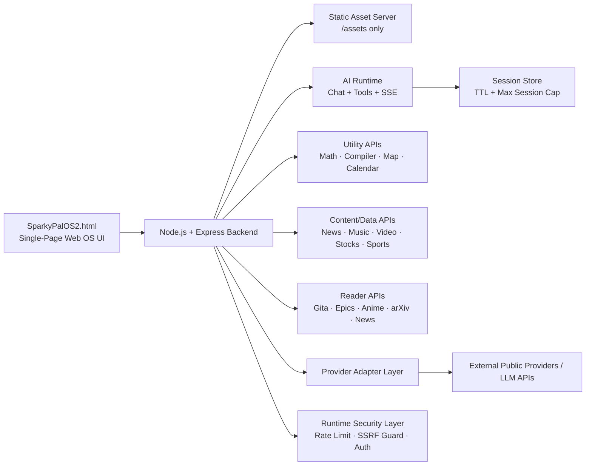

<h1 align="center">⚡ SparkyPalOS</h1>

<p align="center">
  <strong>Retro Desktop-Style Web OS with AI, Tools, Media, Readers, Search, Games & Utility Apps</strong>
</p>

<p align="center">
  <em>A locally runnable browser-based operating system experience powered by a Node.js/Express backend and a single-page retro desktop UI.</em>
</p>

<p align="center">
  
  
  
  
</p>

<p align="center">
  
  
  
  
  
</p>

<p align="center">
  <a href="#-what-is-sparkypalos">Overview</a>
  ·
  <a href="#-live-ui-showcase">Screenshots</a>
  ·
  <a href="#-architecture">Architecture</a>
  ·
  <a href="#-quick-start-local">Quick Start</a>
  ·
  <a href="#-api-catalog">API</a>
  ·
  <a href="#-security-workflow">Security</a>
  ·
  <a href="#-production-deployment">Deploy</a>
</p>

---

## ⚡ What is SparkyPalOS?

**SparkyPalOS** is a retro desktop-style web operating system experience.

It runs as a browser-based desktop environment with a Node.js + Express backend powering AI, tools, media, readers, research feeds, search/data utilities, and productivity workflows.

The project is intentionally lightweight:

```txt
Single-page frontend
        +
Node.js / Express backend
        +
REST APIs + SSE AI streaming
        +
Local-first runtime
```

Default local runtime:

```txt
http://localhost:8787
```

---

## 🧠 Product Thesis

Most AI apps feel like chat boxes.

SparkyPalOS explores a different interface model:

```txt
What if AI tools, readers, utilities, games, search, stocks, maps, news, and productivity apps lived inside a playful retro desktop OS?
```

Instead of forcing everything into one chat window, SparkyPalOS gives users a familiar desktop metaphor:

- apps
- windows
- taskbar
- launcher
- utilities
- readers
- media panels
- retro game windows
- AI assistant surfaces
- responsive layouts

> **SparkyPalOS is a web OS experiment for making AI and utilities feel interactive, spatial, and fun.**

---

## 🖥️ Core Experience

SparkyPalOS provides a desktop-style interface with:

- boot/loading screen
- retro desktop shell
- window manager
- app launchers
- taskbar
- calculator
- math solver
- notepad
- system explorer
- AI chat
- streamed AI responses
- media and content feeds
- map/search tools
- stock and sports endpoints
- readers for books, epics, research, and articles
- virtual PC / retro game-style window
- tablet responsive layout

---

## 🖼️ Live UI Showcase

Captured from a real local run at:

```txt
http://localhost:8787
```

### 1. Boot Loading Screen


### 2. Desktop Overview After Boot/Login


### 3. Calculator + Math Solver Interaction


### 4. Notepad Save Flow + System Explorer


### 5. Virtual PC Game Window


### 6. Tablet Responsive Layout


---

## ✅ What SparkyPalOS Provides

| Layer | Capability |
|---|---|
| Desktop Shell | Retro-style browser OS interface |
| Window Manager | In-window app interactions |
| AI Runtime | Chat, tools, sessions, and SSE streaming |
| Utility Apps | Calculator, math solver, compiler, maps, calendar |
| Content Feeds | News, music, video, research, sports, stocks |
| Readers | Anime/books, Gita, Mahabharat, Ramayan, arXiv, news |
| Security Layer | SSRF guard, rate limiting, production auth, safe static serving |
| Production Runtime | Docker compose, nginx reverse proxy, rollback deploy script |

---

## ⚙️ Architecture



---

## 🧠 System Design View

```txt
┌──────────────────────────────────────────────┐
│              Browser Runtime                 │
│         Retro Desktop Web OS Shell           │
└──────────────────────┬───────────────────────┘
                       ↓
┌──────────────────────────────────────────────┐
│              SparkyPalOS2.html               │
│ Window Manager · Apps · Taskbar · Launchers  │
└──────────────────────┬───────────────────────┘
                       ↓
┌──────────────────────────────────────────────┐
│              Express API Server              │
│ Static Shell · REST APIs · SSE Streaming     │
└──────────────────────┬───────────────────────┘
                       ↓
┌──────────────────────────────────────────────┐
│              Adapter Layer                   │
│ Provider Normalization · Upstream Fetches    │
└──────────────────────┬───────────────────────┘
                       ↓
┌──────────────────────────────────────────────┐
│           External Providers / LLMs          │
│ AI · Search · News · Media · Data Feeds      │
└──────────────────────────────────────────────┘
```

---

## 📦 Repository Structure

```txt
SparkyPalOS2.html
  Single-page frontend shell.
  Handles desktop UI, window manager, app launchers, taskbar, and in-window app UIs.

server/
  index.js
    Express backend entry point.

  publicApiAdapters.js
    Provider normalization and upstream API adapter layer.

assets/
  Static assets exposed by the backend through /assets/* only.

scripts/
  Production deploy and helper scripts.

deploy/
  nginx production reverse proxy config.

docker-compose.prod.yml
  Production app + proxy compose setup.
```

---

## 🧱 Frontend

Entry file:

```txt
SparkyPalOS2.html
```

The frontend handles:

- desktop shell
- boot/loading experience
- window manager
- app launchers
- taskbar
- retro UI panels
- calculator UI
- math solver UI
- notepad UI
- system explorer UI
- virtual PC/game window
- responsive layouts
- backend API calls

The frontend calls backend APIs for:

- AI chat
- AI tools
- SSE streaming
- media feeds
- search/data feeds
- readers
- sports
- stocks
- maps
- utilities

---

## 🧠 Backend

Entry file:

```txt
server/index.js
```

The backend serves:

- static frontend shell
- static assets from `/assets/*` only
- REST APIs under `/api/*`
- SSE streaming for AI at `/api/chat/stream`
- provider diagnostics
- reader endpoints
- productivity tools
- media/data feeds
- production auth enforcement

Adapter layer:

```txt
server/publicApiAdapters.js
```

This layer handles:

- provider normalization
- upstream fetches
- public API response shaping
- fallback-safe integration patterns

---

## 🔁 Runtime Flow

```txt
1. User opens SparkyPalOS in browser
2. Express serves SparkyPalOS2.html
3. User launches desktop apps inside the Web OS
4. Frontend calls /api/* endpoints
5. Backend routes request to AI, utility, reader, media, or provider adapter
6. Response returns to the active desktop window
7. AI chat can stream through SSE
8. Runtime hardening protects sensitive production routes
```

---

## 🚀 Quick Start Local

### 1. Install Dependencies

```bash
npm install
```

---

### 2. Configure Environment

```bash
cp .env.example .env
```

Set at least one LLM key:

```txt
OPENAI_API_KEY=your-key
```

or:

```txt
LLM_API_KEY=your-key
```

---

### 3. Run

```bash
npm start
```

Open:

```txt
http://localhost:8787
```

---

### 4. Dev Mode

```bash
npm run dev
```

---

### 5. Tests

```bash
npm test
```

---

## 🔐 Environment Variables

### Local / Development `.env`

| Variable | Required | Example | Purpose |
|---|---:|---|---|
| `PORT` | No | `8787` | App server port |
| `OPENAI_API_KEY` | Yes* | `sk-...` | Primary LLM credential |
| `LLM_API_KEY` | Yes* | `sk-...` | Alternate LLM credential |
| `LLM_BASE_URL` | No | `https://api.openai.com/v1` | LLM API base URL |
| `LLM_MODEL` | No | `gpt-4o-mini` | Chat model |
| `AGENT_MODEL` | No | `gpt-4o-mini` | Agent pipeline model |
| `AUTH_TOKEN` | No | `my-bearer-token` | Enables Bearer auth |
| `CORS_ORIGINS` | No | `http://localhost:8787` | Comma-separated allowed origins |
| `REQUEST_SIZE_LIMIT` | No | `512kb` | Max request payload size |
| `RATE_LIMIT_WINDOW_MS` | No | `60000` | Rate-limit window |
| `RATE_LIMIT_MAX` | No | `90` | Max requests per window |
| `RATE_LIMIT_MAX_KEYS` | No | `10000` | Max tracked IP buckets |
| `SESSION_TTL_MS` | No | `86400000` | Session TTL for pruning |
| `MAX_SESSIONS` | No | `2000` | Session count cap |

`*` Provide at least one of `OPENAI_API_KEY` or `LLM_API_KEY` for AI features.

---

### Production `.env.production`

| Variable | Required | Example | Purpose |
|---|---:|---|---|
| `NODE_ENV` | Yes | `production` | Production mode |
| `PORT` | No | `8787` | App port inside container |
| `TRUST_PROXY` | Recommended | `1` | Trust reverse proxy headers |
| `CORS_ORIGINS` | Yes | `https://your-domain.com` | Strict allowed origins |
| `REQUEST_SIZE_LIMIT` | Recommended | `512kb` | Request body cap |
| `RATE_LIMIT_WINDOW_MS` | Recommended | `60000` | Rate-limit window |
| `RATE_LIMIT_MAX` | Recommended | `90` | Rate-limit ceiling |
| `RATE_LIMIT_MAX_KEYS` | Recommended | `10000` | Max tracked IP buckets |
| `SESSION_TTL_MS` | Recommended | `86400000` | Session TTL |
| `MAX_SESSIONS` | Recommended | `2000` | Session cap |
| `AUTH_TOKEN` | Yes | `strong-token` | Bearer auth secret |
| `OPENAI_API_KEY` | Yes* | `sk-...` | Primary LLM credential |
| `LLM_API_KEY` | Yes* | `sk-...` | Alternate LLM credential |
| `LLM_MODEL` | No | `gpt-4o-mini` | Model override |

---

## 🧭 API Catalog

### Health / Diagnostics

```txt
GET /api/health
GET /api/providers
GET /api/providers/diagnostics
```

---

### Core AI

```txt
POST /api/session
POST /api/chat
GET  /api/chat/stream
POST /api/tools/:toolName
```

---

### Productivity / Utility

```txt
GET  /api/calendar/events
GET  /api/map/search
GET  /api/map/reverse
POST /api/math/solve
POST /api/compiler/run
```

---

### Content / Media / Data

```txt
GET /api/search
GET /api/music/top-us
GET /api/music/catalog
GET /api/video/cartoons
GET /api/news/live
GET /api/news/read
GET /api/research/arxiv
GET /api/research/arxiv/read
GET /api/sports/suredbits
GET /api/stocks/quote
GET /api/stocks/watchlist
GET /api/stocks/chart
```

---

### Readers / Books

```txt
GET /api/gita/chapters
GET /api/gita/chapters/:id/verses
GET /api/anime/books
GET /api/anime/read
GET /api/epics/mahabharat/chapters
GET /api/epics/mahabharat/read
GET /api/epics/ramayan/chapters
GET /api/epics/ramayan/read
```

---

## 🔒 Production Auth Enforcement

When:

```txt
NODE_ENV=production
```

these routes require:

```txt
Authorization: Bearer <AUTH_TOKEN>
```

Protected routes:

```txt
POST /api/session
POST /api/chat
GET  /api/chat/stream
POST /api/tools/:toolName
POST /api/compiler/run
GET  /api/news/read
GET  /api/anime/read
GET  /api/research/arxiv/read
```

---

## 🛡️ Security Workflow

### Runtime Hardening Highlights

SparkyPalOS includes several production-minded security controls:

| Area | Protection |
|---|---|
| SSRF Guard | Reader URL fetches only allow safe public `http/https` URLs |
| URL Safety | Blocks URL credentials and private/local/link-local hosts |
| Rate Limiting | Keys on trusted `req.ip`, not raw user-controlled headers |
| Static Serving | Only `/assets/*` is publicly served |
| Compiler Sandbox | Subprocess receives minimal environment only |
| Session Store | TTL pruning and max-session cap |
| Production Auth | Sensitive routes require Bearer auth in production |
| CORS | Production origin allowlist through `CORS_ORIGINS` |

---

### Secret-Safe Git Setup

`.gitignore` excludes:

- real env files
- local secrets
- runtime artifacts
- private deployment files

Tracked examples:

```txt
.env.example
.env.production.example
```

Enable hooks once per clone:

```bash
npm run setup:hooks
```

Manual staged secret scan:

```bash
npm run security:scan-staged
```

---

## 🚢 Production Deployment

### Option A: Scripted Deploy with Rollback

1. Configure production env:

```bash
cp .env.production.example .env.production
```

2. Fill required production values.

3. Deploy:

```bash
./scripts/deploy-prod.sh
```

The script:

```txt
1. Builds release image
2. Starts app + nginx proxy
3. Health-checks /api/health
4. Rolls back to last healthy image if health check fails
```

---

### Option B: Direct Docker Compose

```bash
docker compose -f docker-compose.prod.yml --env-file .env.production up -d --build
```

---

## 🌐 Reverse Proxy

Production nginx config:

```txt
deploy/nginx.prod.conf
```

Includes:

- SSE-safe behavior for `/api/chat/stream`
- basic hardening headers
- proxy configuration for app runtime

Headers included:

```txt
X-Frame-Options
X-Content-Type-Options
Referrer-Policy
```

---

## 🖥️ VPS Deployment Checklist

```txt
1. Install Docker + Docker Compose plugin
2. Copy project to server
3. Create .env.production
4. Set domain-specific CORS_ORIGINS
5. Set AUTH_TOKEN
6. Set LLM credential
7. Run ./scripts/deploy-prod.sh
8. Put TLS in front
9. Verify /api/health
10. Open app domain in browser
```

Recommended TLS options:

- Cloudflare Tunnel
- Caddy
- nginx + Let's Encrypt

Verify health:

```bash
curl http://127.0.0.1/api/health
```

---

## 🧪 Testing

Run test suite:

```bash
npm test
```

Useful checks before deployment:

```bash
npm run security:scan-staged
npm test
npm start
```

---

## 🧰 Troubleshooting

### App opens but AI is unavailable

Check that at least one credential is set:

```txt
OPENAI_API_KEY
LLM_API_KEY
```

Check production logs:

```bash
docker compose -f docker-compose.prod.yml logs -f app
```

---

### CORS errors from browser

Set exact frontend origin:

```txt
CORS_ORIGINS=https://your-domain.com
```

Restart after env updates.

---

### Reader endpoint returns `invalid_request` unsafe URL

Reader fetches block localhost/private/internal targets by design.

Use public `http/https` article/text URLs only.

---

### SSE stream disconnects early

Use the provided reverse proxy config:

```txt
deploy/nginx.prod.conf
```

Check proxy timeout and buffering settings for:

```txt
/api/chat/stream
```

---

### Sports/news/arXiv or other feeds are empty

Public upstream providers may be temporarily unavailable.

Inspect diagnostics:

```txt
GET /api/providers/diagnostics
```

---

## 📊 Product Status

| Area | Status |
|---|---|
| Retro desktop UI | Active |
| Window manager | Active |
| Taskbar + launcher | Active |
| AI chat | Active |
| SSE streaming | Active |
| Math solver | Active |
| Compiler route | Active |
| Calendar/map utilities | Active |
| News/media/research feeds | Active |
| Reader APIs | Active |
| Stocks/sports endpoints | Active |
| SSRF guard | Active |
| Rate limiting | Active |
| Production auth enforcement | Active |
| Docker production deployment | Active |
| Reverse proxy config | Active |

---

## 🧠 Design Principles

SparkyPalOS is built around seven principles:

```txt
1. Make AI feel spatial, not trapped in one chat box.
2. Use a playful retro desktop metaphor.
3. Keep the app locally runnable.
4. Keep the backend simple and inspectable.
5. Treat public readers and URL fetches as security-sensitive.
6. Make production deployment realistic.
7. Preserve the joy of old-school computing inside a modern web app.
```

---

## 🧾 Example User Flow

```txt
User boots SparkyPalOS.

The desktop loads.

User opens:
- AI assistant
- calculator
- notepad
- system explorer
- reader app
- virtual PC game window

The frontend calls Express APIs.

The backend handles:
- AI streaming
- provider fetches
- utility execution
- reader safety
- session lifecycle
- rate limits
- production auth

The result feels like a tiny browser-native operating system.
```

---

## 🚀 Portfolio Outcomes

This project demonstrates:

- single-page app architecture
- retro OS-style UI/UX design
- backend API orchestration
- SSE streaming
- provider adapter design
- runtime hardening
- SSRF-aware reader endpoints
- production auth enforcement
- Docker deployment
- reverse proxy configuration
- secret-safe git workflow
- local-first product engineering

Built with:

```txt
HTML · CSS · JavaScript · Node.js · Express · SSE · Docker · nginx
```

---

## 📌 Note on Project Scope

SparkyPalOS is a creative web OS experiment and local product prototype.

It is designed for:

- portfolio demonstration
- retro desktop UI exploration
- AI utility experimentation
- local-first product development
- production deployment practice

---

## 📜 License

Licensed under **GNU AGPLv3**.

See:

```txt
LICENSE
```

---

## ⭐ Final Thought

Most AI apps are just another chat window.

SparkyPalOS asks a different question:

```txt
What if AI tools lived inside a playful web operating system?
```

**SparkyPalOS exists to make AI feel like an interactive desktop world — not just a textbox.**
