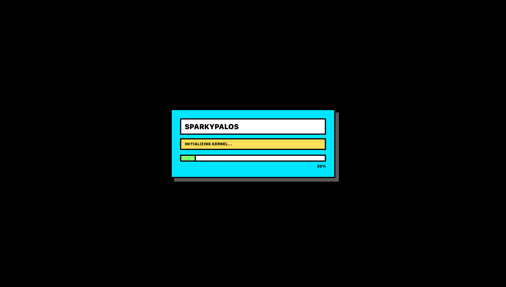
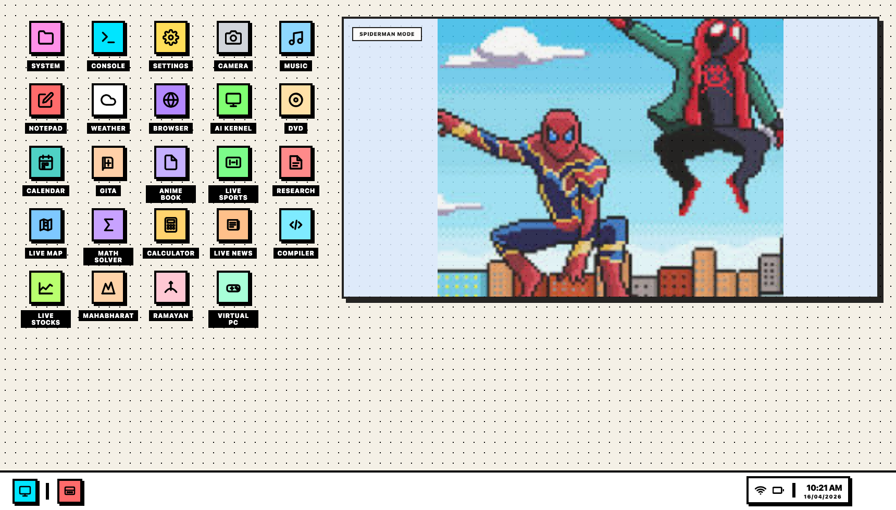
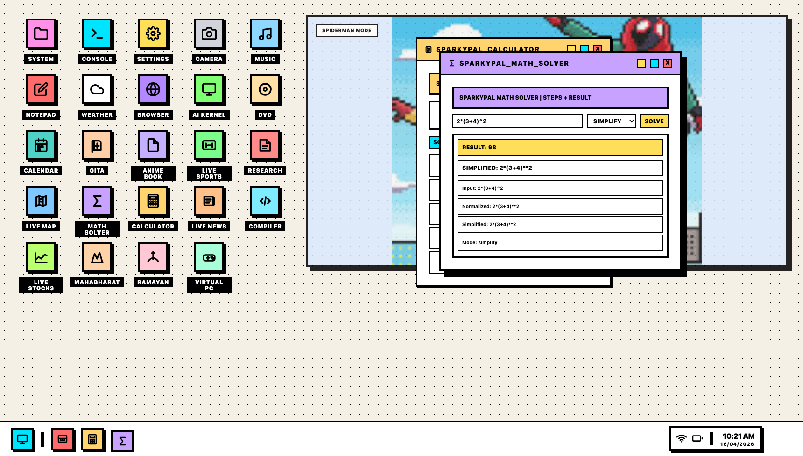
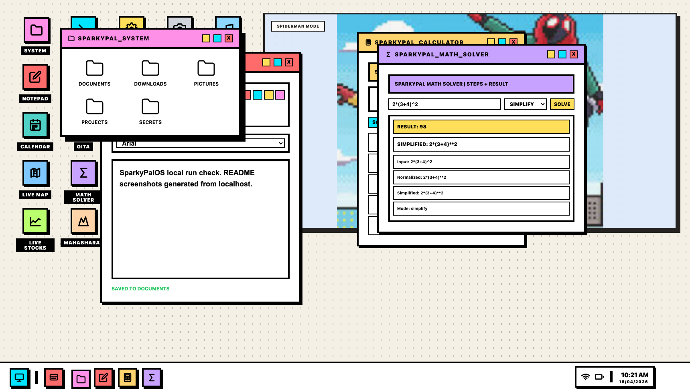
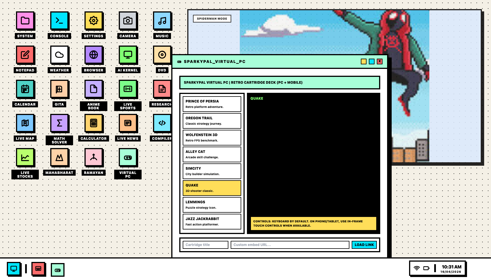
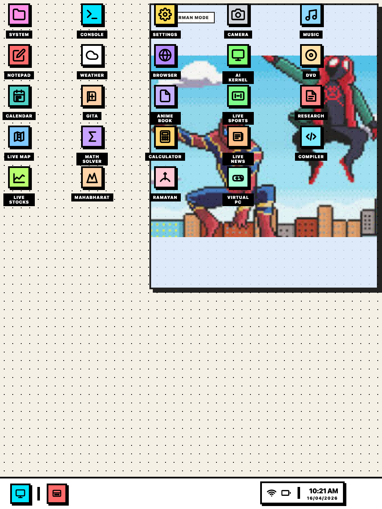

# SparkyPalOS

SparkyPalOS is a retro desktop-style web OS experience.

- Frontend: single-page UI in `SparkyPalOS2.html`
- Backend: Node.js + Express API in `server/index.js`
- Runtime default: `http://localhost:8787`

## Live UI Images (Localhost)

Captured from a real local run at `http://localhost:8787` on April 16, 2026.

### 1) Boot loading screen (startup)


### 2) Desktop overview after boot/login


### 3) Calculator + Math Solver interaction


### 4) Notepad save flow + System explorer


### 5) Virtual PC game window (retro cartridge loaded)


### 6) Tablet responsive layout


## Architecture

### Frontend
- Entry file: `SparkyPalOS2.html`
- Handles desktop/window manager, app launchers, taskbar, and in-window app UIs.
- Calls backend APIs for AI, media, search/data feeds, readers, sports, stocks, map, and utility tools.

### Backend
- Entry file: `server/index.js`
- Express server serving:
  - Static frontend (`/` -> `SparkyPalOS2.html`)
  - REST APIs under `/api/*`
  - SSE streaming for AI (`/api/chat/stream`)
- Adapter layer: `server/publicApiAdapters.js` (provider normalization and upstream fetches).

## Quick Start (Local)

### 1) Install
```bash
npm install
```

### 2) Configure env
```bash
cp .env.example .env
```
Set at least one key:
- `OPENAI_API_KEY` or `LLM_API_KEY`

### 3) Run
```bash
npm start
```
Open `http://localhost:8787`.

### 4) Dev mode (auto-restart)
```bash
npm run dev
```

### 5) Tests
```bash
npm test
```

## Environment Variables

### `.env` (local/dev)

| Variable | Required | Example | Purpose |
|---|---|---|---|
| `PORT` | No | `8787` | App server port |
| `OPENAI_API_KEY` | Yes* | `sk-...` | Primary LLM credential |
| `LLM_API_KEY` | Yes* | `sk-...` | Alternate LLM credential |
| `LLM_BASE_URL` | No | `https://api.openai.com/v1` | LLM API base URL |
| `LLM_MODEL` | No | `gpt-4o-mini` | Chat model |
| `AGENT_MODEL` | No | `gpt-4o-mini` | Agent pipeline model |
| `AUTH_TOKEN` | No | `my-bearer-token` | Enables Bearer auth on protected API routes |
| `CORS_ORIGINS` | No | `http://localhost:8787` | Comma-separated allowed origins |
| `REQUEST_SIZE_LIMIT` | No | `512kb` | Max request payload size |
| `RATE_LIMIT_WINDOW_MS` | No | `60000` | Rate-limit window |
| `RATE_LIMIT_MAX` | No | `90` | Max requests per window |

`*` Provide at least one of `OPENAI_API_KEY` or `LLM_API_KEY` for AI features.

### `.env.production`

| Variable | Required | Example | Purpose |
|---|---|---|---|
| `NODE_ENV` | Yes | `production` | Production mode |
| `PORT` | No | `8787` | App port inside container |
| `TRUST_PROXY` | Recommended | `1` | Trust reverse proxy headers |
| `CORS_ORIGINS` | Yes | `https://your-domain.com` | Strict allowed origins |
| `REQUEST_SIZE_LIMIT` | Recommended | `512kb` | Request body cap |
| `RATE_LIMIT_WINDOW_MS` | Recommended | `60000` | Rate-limit window |
| `RATE_LIMIT_MAX` | Recommended | `90` | Rate-limit ceiling |
| `AUTH_TOKEN` | Recommended | `strong-token` | Bearer auth for protected routes |
| `OPENAI_API_KEY` | Yes* | `sk-...` | Primary LLM credential |
| `LLM_API_KEY` | Yes* | `sk-...` | Alternate LLM credential |
| `LLM_MODEL` | No | `gpt-4o-mini` | Model override |

## API Catalog

### Health / diagnostics
- `GET /api/health`
- `GET /api/providers`
- `GET /api/providers/diagnostics`

### Core AI
- `POST /api/session`
- `POST /api/chat`
- `GET /api/chat/stream` (SSE)
- `POST /api/tools/:toolName`

### Productivity / utility
- `GET /api/calendar/events`
- `GET /api/map/search`
- `GET /api/map/reverse`
- `POST /api/math/solve`
- `POST /api/compiler/run`

### Content / media / data
- `GET /api/search`
- `GET /api/music/top-us`
- `GET /api/music/catalog`
- `GET /api/video/cartoons`
- `GET /api/news/live`
- `GET /api/news/read`
- `GET /api/research/arxiv`
- `GET /api/research/arxiv/read`
- `GET /api/sports/suredbits`
- `GET /api/stocks/quote`
- `GET /api/stocks/watchlist`
- `GET /api/stocks/chart`

### Readers / books
- `GET /api/gita/chapters`
- `GET /api/gita/chapters/:id/verses`
- `GET /api/anime/books`
- `GET /api/anime/read`
- `GET /api/epics/mahabharat/chapters`
- `GET /api/epics/mahabharat/read`
- `GET /api/epics/ramayan/chapters`
- `GET /api/epics/ramayan/read`

## Security Workflow

### Secret-safe git setup
1. `.gitignore` excludes all real env files and local artifacts.
2. `.env.example` and `.env.production.example` stay tracked.
3. Pre-push secret scan blocks likely keys/tokens in staged changes.

Enable hooks once per clone:
```bash
npm run setup:hooks
```

Manual scan (optional):
```bash
npm run security:scan-staged
```

## Production Deployment (Docker + Reverse Proxy)

### Option A: Scripted deploy with rollback
1. Configure production env:
```bash
cp .env.production.example .env.production
```
2. Fill required production values.
3. Deploy:
```bash
./scripts/deploy-prod.sh
```

What this does:
- Builds a release image
- Starts app + nginx proxy from `docker-compose.prod.yml`
- Health-checks `/api/health`
- Rolls back to last healthy image if check fails

### Option B: Direct compose
```bash
docker compose -f docker-compose.prod.yml --env-file .env.production up -d --build
```

### Reverse proxy
- Config file: `deploy/nginx.prod.conf`
- Includes SSE-safe behavior for `/api/chat/stream`
- Adds basic hardening headers (`X-Frame-Options`, `X-Content-Type-Options`, `Referrer-Policy`)

## VPS Deployment Checklist

1. Install Docker + Docker Compose plugin.
2. Copy project to server.
3. Set `.env.production` with domain-specific `CORS_ORIGINS`.
4. Run `./scripts/deploy-prod.sh`.
5. Put TLS in front (recommended: Cloudflare Tunnel, Caddy, or nginx with Let's Encrypt).
6. Verify:
   - `curl http://127.0.0.1/api/health`
   - open app domain in browser

## Troubleshooting

### App opens but AI is unavailable
- Confirm `OPENAI_API_KEY` or `LLM_API_KEY` is set.
- Check logs:
```bash
docker compose -f docker-compose.prod.yml logs -f app
```

### CORS errors from browser
- Set exact frontend origin in `CORS_ORIGINS`.
- Restart app after env updates.

### SSE stream disconnects early
- Ensure proxy uses provided `deploy/nginx.prod.conf`.
- Check timeout and buffering settings for `/api/chat/stream`.

### Sports/news/arXiv or other feeds are empty
- Upstream public providers may be temporarily unavailable.
- Retry and inspect `/api/providers/diagnostics`.

## Agent Pipeline Artifacts

Run:
```bash
npm run agents
```
Outputs are generated under `agent-output/`.

## License

Licensed under GNU AGPLv3. See `LICENSE`.
