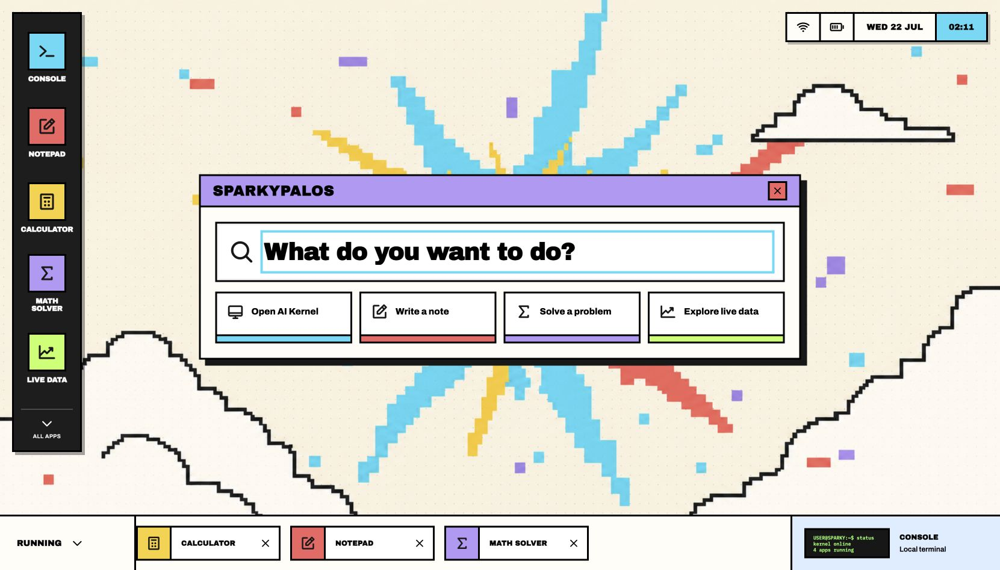
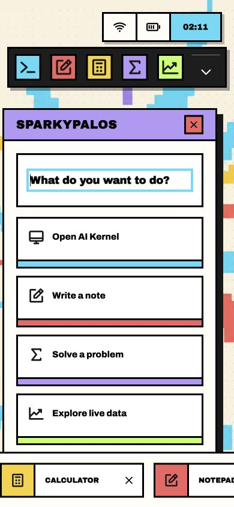
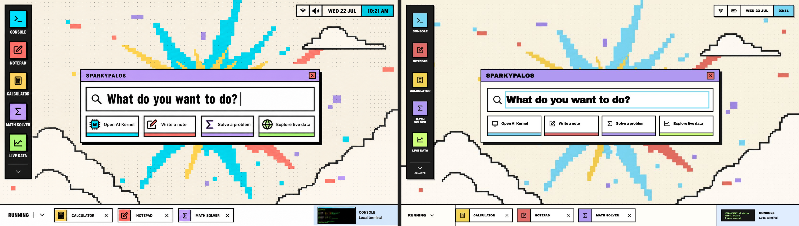
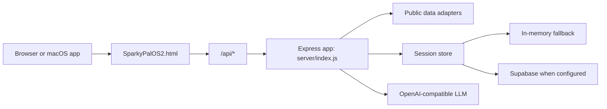

# SparkyPalOS

SparkyPalOS is a launcher-first retro web OS: a playful desktop shell for AI chat, notes, math, live data, media, readers, sports, stocks, maps, and lightweight coding tools.

Live product: https://sparkypalos.vercel.app

macOS app download: https://github.com/ShivanshSGuppta/SparkyPalOS/releases/latest/download/SparkyPalOS-macOS.zip

## Product Images

Final desktop build:



Mobile build:



Source-to-final design QA:



## What Changed

- Rebuilt the first screen around a central launcher instead of a passive desktop.
- Added an original Spark Burst wallpaper in `assets/wallpapers/spark-burst.png`.
- Added pinned apps, launcher search, Enter-to-launch behavior, and a running app strip.
- Preserved the existing app windows and backend API flows.
- Added accessible window controls and visible keyboard focus.
- Added responsive desktop, tablet, and mobile layouts.
- Added Vercel serverless deployment support through `api/index.js` and `vercel.json`.
- Added optional Supabase persistence/auth support for production installs.
- Added a native macOS WebKit wrapper and repeatable build script.

## Architecture


```mermaid
flowchart LR
    User["Browser or macOS app"] --> UI["SparkyPalOS2.html"]
    UI --> API["/api/*"]
    API --> Express["Express app: server/index.js"]
    Express --> Adapters["Public data adapters"]
    Express --> Sessions["Session store"]
    Sessions --> Memory["In-memory fallback"]
    Sessions --> Supabase["Supabase when configured"]
    Express --> LLM["OpenAI-compatible LLM"]
```

Read the detailed architecture in [docs/ARCHITECTURE.md](docs/ARCHITECTURE.md).

Read the product context and creative direction in [docs/PRODUCT_CONTEXT.md](docs/PRODUCT_CONTEXT.md).

Read visual QA evidence in [design-qa.md](design-qa.md).

## Repository Map

- `SparkyPalOS2.html` - single-page launcher-first desktop UI.
- `server/index.js` - Express app, API routes, auth, rate limits, static serving.
- `api/index.js` - Vercel function adapter for the Express app.
- `server/publicApiAdapters.js` - public provider adapters for feeds, readers, data, and utilities.
- `server/sessionStore.js` - in-memory sessions with optional Supabase persistence.
- `server/supabaseClient.js` - Supabase client setup and JWT validation.
- `supabase/migrations/20260525_initial_sparkypal.sql` - Supabase schema.
- `macos/SparkyPalOS/main.swift` - native macOS WebKit wrapper.
- `scripts/build-macos-app.sh` - macOS `.app` zip builder.
- `artifacts/design-qa/` - screenshots and visual QA comparisons.
- `assets/design/` and `assets/wallpapers/` - design source and product imagery.

## Local Development

Install dependencies:

```bash
npm install
```

Create local env:

```bash
cp .env.example .env
```

Run locally:

```bash
npm start
```

Open:

```text
http://localhost:8787
```

Run tests:

```bash
npm test
```

## macOS App

Build a native macOS wrapper around the live web product:

```bash
SPARKYPAL_APP_URL=https://sparkypalos.vercel.app npm run build:macos
```

Output:

```text
dist/SparkyPalOS-macOS.zip
```

The app loads the production URL and does not require this repo, Node, or local env files on the target machine.

The release asset is ad-hoc signed, not Apple Developer ID notarized. On a fresh Mac, use right-click `Open` if Gatekeeper asks for confirmation.

## Vercel Deployment

Production is deployed at:

```text
https://sparkypalos.vercel.app
```

The deployment uses:

- `vercel.json` routes for static assets, the HTML shell, and `/api/*`.
- `api/index.js` as the Vercel Node function entry point.
- Runtime env locks for public deployments:
  - `NODE_ENV=production`
  - `TRUST_PROXY=1`
  - `CORS_ORIGINS=https://sparkypalos.vercel.app`
  - `DISABLE_PUBLIC_COMPILER=1`
  - `DISABLE_PUBLIC_TOOLS=1`

Deploy manually:

```bash
npx vercel deploy --prod --scope shiz7s-projects --project sparkypalos
```

## Supabase

Supabase is optional. The app runs without it by using an in-memory session fallback. Configure Supabase when you want persistent sessions, stored messages, and Supabase JWT auth.

Apply the schema:

```text
supabase/migrations/20260525_initial_sparkypal.sql
```

Set these production variables in Vercel when enabling Supabase:

```text
SUPABASE_URL
SUPABASE_ANON_KEY
SUPABASE_SERVICE_ROLE_KEY
```

## Environment Variables

Important runtime variables:

| Variable | Required | Purpose |
|---|---:|---|
| `OPENAI_API_KEY` or `LLM_API_KEY` | Optional for demo, required for AI | Enables AI chat and streaming |
| `LLM_BASE_URL` | No | OpenAI-compatible API base URL |
| `LLM_MODEL` | No | Chat model override |
| `AUTH_TOKEN` | Recommended for admin routes | Bearer token fallback in production |
| `CORS_ORIGINS` | Production | Allowed browser origins |
| `SUPABASE_URL` | No | Enables Supabase integration |
| `SUPABASE_ANON_KEY` | No | Public Supabase client/JWT validation |
| `SUPABASE_SERVICE_ROLE_KEY` | No | Server-side Supabase persistence |
| `POSTHOG_KEY` | No | Product analytics |
| `SENTRY_DSN` | No | Backend/API error monitoring |
| `SENTRY_DSN_PUBLIC` | No | Frontend error monitoring |
| `DISABLE_PUBLIC_COMPILER` | Recommended | Locks compiler route for public deployments |
| `DISABLE_PUBLIC_TOOLS` | Recommended | Locks tool gateway for public deployments |

## API Catalog

Health and config:

- `GET /api/health`
- `GET /api/public-config`
- `GET /api/providers`
- `GET /api/providers/diagnostics`

Core AI:

- `POST /api/session`
- `POST /api/chat`
- `GET /api/chat/stream`
- `POST /api/tools/:toolName`

Utility and content:

- `GET /api/calendar/events`
- `GET /api/map/search`
- `GET /api/map/reverse`
- `POST /api/math/solve`
- `POST /api/compiler/run`
- `GET /api/search`
- `GET /api/music/top-us`
- `GET /api/music/catalog`
- `GET /api/video/cartoons`
- `GET /api/news/live`
- `GET /api/news/read`
- `GET /api/research/arxiv`
- `GET /api/research/arxiv/read`
- `GET /api/sports/suredbits`
- `GET /api/stocks/quote`
- `GET /api/stocks/watchlist`
- `GET /api/stocks/chart`
- `GET /api/gita/chapters`
- `GET /api/gita/chapters/:id/verses`
- `GET /api/anime/books`
- `GET /api/anime/read`
- `GET /api/epics/mahabharat/chapters`
- `GET /api/epics/mahabharat/read`
- `GET /api/epics/ramayan/chapters`
- `GET /api/epics/ramayan/read`

## Security Notes

- Static serving is restricted to the HTML shell and `/assets/*`.
- Sensitive production API routes require a bearer token.
- Supabase JWTs are accepted when Supabase is configured.
- Reader fetches block local, private, and link-local URLs.
- Rate limiting keys on trusted `req.ip`, not raw user-controlled forwarding headers.
- Generated local env files, Vercel metadata, Supabase metadata, and build artifacts stay ignored.

## License

Licensed under GNU AGPLv3. See [LICENSE](LICENSE).
