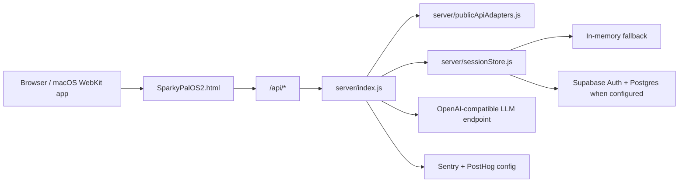

# SparkyPalOS Architecture

SparkyPalOS is a launcher-first web OS prototype with a single-page desktop shell, an Express API backend, an optional Supabase persistence layer, and a Vercel serverless deployment target.

## Runtime Topology



## Frontend Shell

- `SparkyPalOS2.html` owns the boot flow, login modal, launcher, pinned rail, running app strip, and window manager.
- The redesign uses an original Spark Burst wallpaper in `assets/wallpapers/spark-burst.png`.
- Product surfaces include Console, Notepad, Calculator, Math Solver, Live Data, readers, sports, music, maps, stocks, and AI chat.
- Browser storage keeps lightweight client state such as auth token and user preferences.

## Backend API

- `server/index.js` creates the Express app and exports it for both local Node and Vercel.
- `api/index.js` adapts the Express app directly to Vercel Node functions.
- `server/publicApiAdapters.js` normalizes public feeds and upstream providers.
- `server/llmAdapter.js` supports OpenAI-compatible chat and streaming.
- `server/monitoring.js` initializes Sentry when configured.

## Data Layer

Supabase is optional. When `SUPABASE_URL` and keys are present, sessions and messages persist to Postgres using `server/sessionStore.js`. Without Supabase, the app falls back to a bounded in-memory session store so demos and public previews still run.

The schema lives in `supabase/migrations/20260525_initial_sparkypal.sql` and includes:

- `sessions`
- `messages`
- `app_documents`
- `rate_limits`

## Deployment

Vercel hosts:

- Static shell: `/` and `/SparkyPalOS2.html`
- Static assets: `/assets/*`
- Serverless API: `/api/*`

Production runtime locks:

- `DISABLE_PUBLIC_COMPILER=1`
- `DISABLE_PUBLIC_TOOLS=1`
- `CORS_ORIGINS=https://sparkypalos.vercel.app`

Sensitive API routes require a bearer token in production. Supabase JWTs are accepted when Supabase is configured; `AUTH_TOKEN` remains available for controlled internal/admin use.

## macOS App

The macOS app is a native Swift/WebKit wrapper around the production URL. It does not bundle secrets and does not require the local Node server. Build it with:

```bash
SPARKYPAL_APP_URL=https://sparkypalos.vercel.app npm run build:macos
```

The output is `dist/SparkyPalOS-macOS.zip`.
