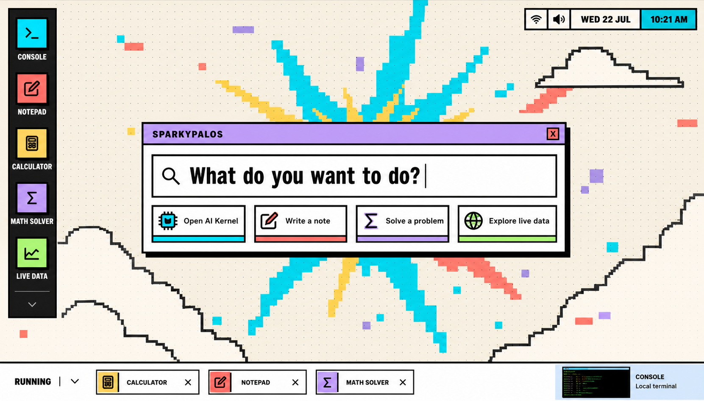

# Product Context and Creative Direction

SparkyPalOS is positioned as a playful personal operating system for launching useful tools from one expressive desktop. The product should feel more like a usable toy-computer than a standard dashboard: immediate, tactile, loud in its visual language, but still functional enough for repeated daily use.

## Design Intent

The redesign moves SparkyPalOS from a traditional windowed desktop into a launcher-first experience. The main screen puts search and primary actions in the center, keeps pinned apps on the left, and reserves the bottom strip for currently running work.

Core creative decisions:

- Retro-computing composition with hard borders, high-contrast blocks, and compact work surfaces.
- Bright multi-color palette instead of a single dominant hue.
- Original Spark Burst wallpaper to keep the product identity energetic without relying on copyrighted character art.
- Consistent icon language using a real icon family rather than placeholder drawings.
- Responsive geometry for desktop, tablet, and mobile so the launcher remains the first interaction.

## Thought Process

1. Keep the existing app inventory and backend contracts intact.
2. Make the launcher the product's primary mental model.
3. Use the wallpaper as brand atmosphere, not as decoration that competes with controls.
4. Preserve utility: search, Enter-to-launch, window minimize/restore, and running app state all need to work.
5. Treat Supabase as an upgrade path, not a hard demo dependency.
6. Ship both a web deployment and a macOS wrapper so the project survives beyond this local machine.

## Product Images

Selected visual target:

Final desktop build:

Source-to-final comparison:

Mobile build:

